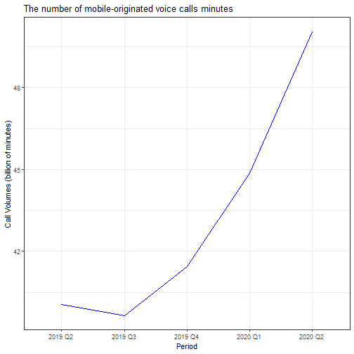
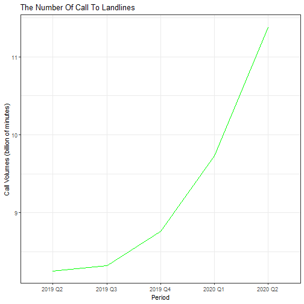
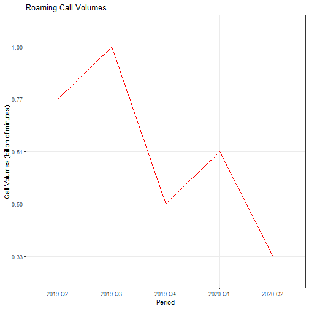

## **Introduction**

I was expecting a course about a tool similar to excel and its many functions showing me how to manipulate data with an intuitive interface to build fancy graphs, instead, I was confronted by programming, which is rocket science for me. I nearly gave up several times however motivation to persevere came mostly from a lot of online help from countless kind souls, so if you have ever posted on a GitHub or Coursera-related forums, please accept my sincerest gratitude. After many hours of trial and error,  yes even with help, I finally got to the part of the course, for which I had enrolled, creating pictorial representations that would illuminate the wisdom lying dormant in the data.  

Excited to use these new skills I decided to practice with data obtained from the industry I know best and a topic that has been most prevalent in all our lives for 2020. Still learning so for any professionals reading this, please bear with me :).  

I think I might look into tableau and power bi at some point but for now, will continue to play with R Studio and its brilliant library of packages. 

##  **Title: Ofcom Data Analysis: Impact Of Covid-19 On UK Mobile Call Volumes**

A graphical representation of OfCOM Telecommunications Market Data Update Q2 2020 with specific focus on the impact of covid-19 on UK Mobile Call Volumes. Source Data obtained from: https://www.ofcom.org.uk/research-and-data/telecoms-research/data-updates/telecommunications-market-data-update-q2-2020

##  **Loading and pre-processing the data**

###  Extract tables from pdf file


```r
setwd("~/RStudioScripts/h4ppyd4ys.github.io/_dse")
library(dplyr)
library(tabulizer)
library(tidyverse)
library(knitr)
library(reshape2)
out <- extract_tables("telecoms-data-update-q2-2020.pdf")
```

###  Call and message volumes by call type (billions of minutes/messages/PB)
####  Extract required table

```r
temp <- data.frame(out[[12]])
temp1 <- temp[27:31,]
```
####  Tidy Data

```r
temp2 <- temp1 %>%
  separate(X2, c("X2", "X2.1","X2.2"), sep =" ") %>%
  separate(X4, c("X4", "X4.1"), sep =" ")

temp3 <- temp2 %>%
        select(X1,X2,X2.1,X5) %>%
        rename("Period" = X1,
               "AllCalls" = X2,
               "UKFixedCalls" = X2.1,
               "Roaming" = X5)

temp3$AllCalls <- as.numeric(temp3$AllCalls)
temp3$UKFixedCalls <- as.numeric(temp3$UKFixedCalls)
temp3$Roaming <- as.character(temp3$Roaming)

temp3
```

```
##     Period AllCalls UKFixedCalls Roaming
## 27 2019 Q2    40.06         8.25    0.77
## 28 2019 Q3    39.64         8.32    1.00
## 29 2019 Q4    41.45         8.76    0.50
## 30 2020 Q1    44.88         9.73    0.51
## 31 2020 Q2    50.05        11.38    0.33
```

##  Results

###  1. The number of mobile-originated voice calls minutes increased by 10.0 billion (24.9%) to 50 billion minutes in Q2 2020




###  2. Calls to landlines increasing by 37.9% to 11.4 billion minutes


```r
ggplot(data = temp3)+
  aes(x=Period,y=UKFixedCalls, group=1)+
  geom_line(col="green")+
  labs(title= "The Number Of Call To Landlines")+
  ylab("Call Volumes (billion of minutes)")+
  theme_bw()
```




###  3. Roaming call volumes decreased by 57.1% to 0.3 billion minutes compared to a year previously, again likely due to Covid-related travel restrictions.


```r
ggplot(data = temp3)+
  aes(x=Period,y=Roaming, group=1)+
  geom_line(col="red")+
  labs(title= "Roaming Call Volumes")+
  ylab("Call Volumes (billion of minutes)")+
  theme_bw()
```



###  Summary: The number of mobile-originated voice calls minutes increased by 10.0 billion (24.9%) to 50 billion minutes in Q2 2020, with calls to landlines increasing by 37.9% to 11.4 billion minutes. These increases are likely due to the Covid-19 restrictions, which began in late March 2020.Roaming call volumes decreased by 57.1% to 0.3 billion minutes compared to a year previously, again likely due to Covid-related travel restrictions.


