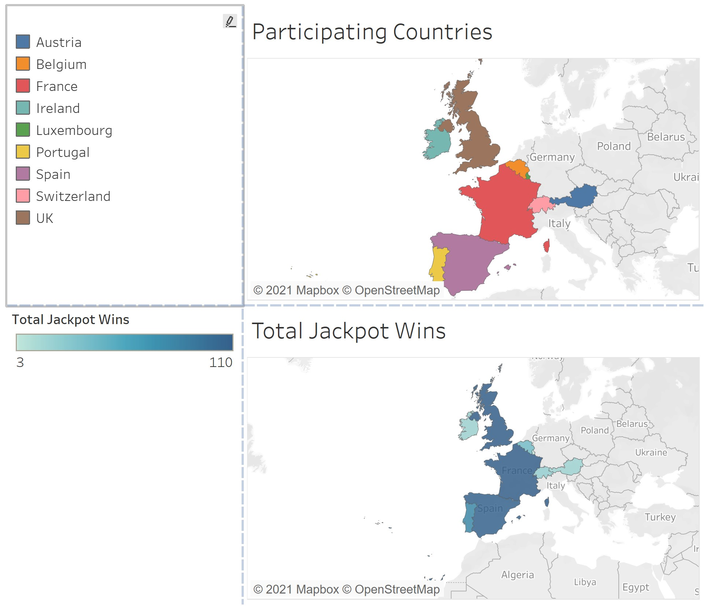
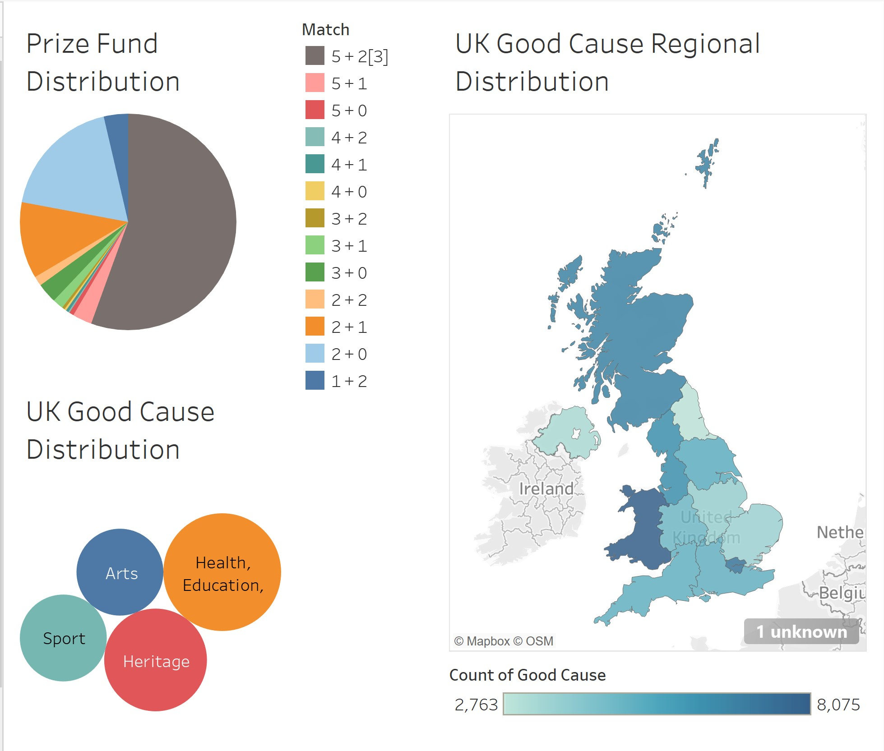

## **Introduction**  

I wanted to practice web scrapping with R, which led me to search for free data sources available on the internet and as I continued down the rabbit hole, I found [Tableau Public](https://public.tableau.com/s/) (thanks again google).  Pleasantly surprised, and overwhelmed by the amount of free data sources available, I spent a good few hours having fun on [google trends](https://trends.google.com/trends/?geo=US). 

Alas, my skills set seems frustratingly inadequate for the questions I want to explore and so within the boundaries of these limitations and motivation, I found myself at the euro lottery website. The output you see below used some web scrapping from the euro lottery website as well as an import of CSV data provided by the UK government under the Open Government Licence v3.0. The dashboards are created from tableau public.  

## **Participating Countries**

"It always seems impossible until it is done - Nelson Mandela"

EU and Non-EU countries working together to make the impossible come true. :)

## **UK Fund Distribution - Where does the money go?**

)

Data Sources:

https://www.euro-millions.com/participating-countries

https://www.lottery.culture.gov.uk/

Prize Distribution Caveats:
*Figures calculated using results drawn between 27/09/2016 and 19/01/2021.		source: EuroMillions Prizes & Prize Fund Distribution(https://www.euro-millions.com/prizes#:~:text=EuroMillions%20prizes%20are%20funded%20using,well%20as%20covering%20operating%20costs.)			
This column displays the percentage of the prize fund allocated to each prize level. **The remaining 10%** goes into a separate fund, known as the Booster Fund, which is used to ensure there is always enough for the advertised minimum jackpot. EuroMillions occasionally holds special draws or promotions, where the guaranteed minimum jackpot can be increased up to as much as €130 million, using surplus funds from the Booster Fund.*  

##  **FInal Thoughts**

I love Tableau! and will take a course to learn how to use the features for a better output. The next step though is to check whether it is possible to publish the dashboard or story from tableau to this blog space in Github. The output in tableau is much more interactive, however, for now I only managed to grab a picture for this markdown post. I suspect, I will have to invest in Tableau desktop or publish as a tableau viz in some other space. 

Exploring lottery data was a lot of fun. It is nice to see an example of neighboring countries working together for win-win endeavors and to know that, however great the odds, each week hope is invigorated for the many.The result is life-changing moments for a lucky few and a little bit of the money, 28p for every £1 in the UK,  that goes towards good causes. 

May the odds always be in your favor, if you have a ticket 😉
