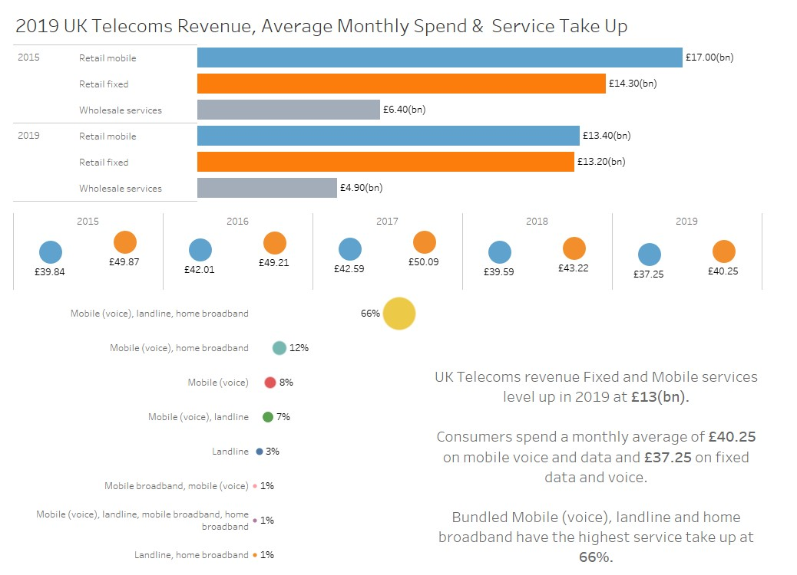
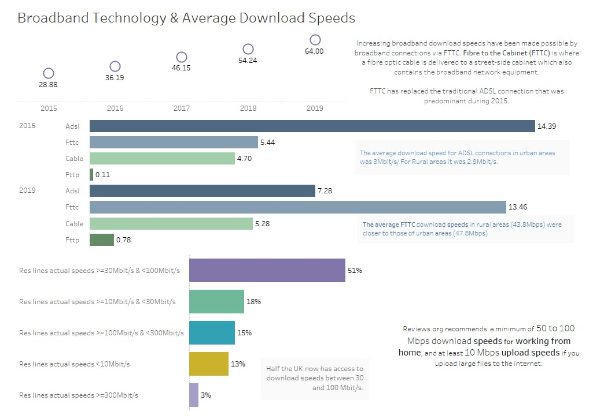

Source: Ofcom: UK home broadband performance report published: May 2019 (https://www.ofcom.org.uk/__data/assets/pdf_file/0020/147332/home-broadband-report-2018.pdf), using data provided by SamKnows.  
Note: Measurements taken in Q4 of each year

For a more interactive experience of this story visit tableau public [here](https://public.tableau.com/views/OfCOMUK2019MobileFIxedBroadbandTakeaways/Dashboard4?:language=en-GB&:display_count=y&:origin=viz_share_link)

